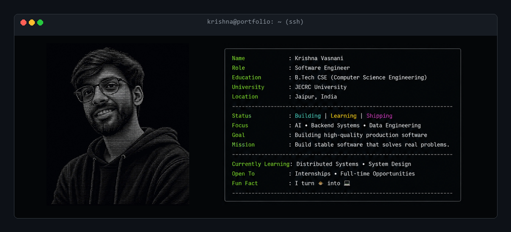

  

---

<pre>
<b>krishna@portfolio:~$</b> tree projects/ --level=2

<b>projects/</b>
├── 📊 <b>n100-financial-intelligence-platform</b>
│   ├── Ingests raw equity filings, runs 16 data quality rules, computes 50+ KPIs.
│   ├── Tech: Python • SQLite • Streamlit • Pandas • Pytest
│   └── Link: <a href="https://github.com/krishnavasnani07/n100-financial-intelligence-platform">github.com/krishnavasnani07/n100-financial-intelligence-platform</a>
│
├── 📈 <b>fundsight-mutual-fund-analytics</b>
│   ├── High-performance mutual fund analytics database with transaction-safe ETL.
│   ├── Tech: Python • SQLite • Streamlit • FastAPI • Pandas
│   └── Link: <a href="https://github.com/krishnavasnani07/fundsight-mutual-fund-analytics">github.com/krishnavasnani07/fundsight-mutual-fund-analytics</a>
│
├── 👁️ <b>second-pair-of-eyes</b>
│   ├── Edge TF.js detection &amp; Gemini Vision API cloud safety alerts.
│   ├── Tech: TensorFlow.js • Gemini API • FastAPI • Cloud Run
│   └── Link: <a href="https://github.com/krishnavasnani07/second-pair-of-eyes">github.com/krishnavasnani07/second-pair-of-eyes</a>
│
└── 🎬 <b>CinAImatic</b>
    ├── Neural network recommendation engine with live training diagnostics.
    ├── Tech: Python • FastAPI • Scikit-Learn • Groq API • Vite
    └── Link: <a href="https://github.com/krishnavasnani07/CinAImatic">github.com/krishnavasnani07/CinAImatic</a>
</pre>

---

<pre>
<b>krishna@portfolio:~$</b> cat stack.conf

<b>[Languages]</b>
  └── Python • C++ • JavaScript • SQL

<b>[Backend &amp; Storage]</b>
  └── FastAPI • SQLite • Pandas • NumPy • WebSockets

<b>[Frontend &amp; UI]</b>
  └── Streamlit • Vite • TailwindCSS • HTML/CSS

<b>[AI &amp; Machine Learning]</b>
  └── Scikit-Learn • TensorFlow.js • Gemini API • Groq API

<b>[Cloud &amp; DevOps]</b>
  └── Google Cloud Run • Docker • Git • Pytest
</pre>

---

<pre>
<b>krishna@portfolio:~$</b> git status

On branch main
Your branch is up to date with 'origin/main'.

Changes to be committed:
  (use "git restore --staged <file>..." to unstage)

	modified:   profile_assets/profile.jpg
	modified:   krishnavasnani07/README.md

Status: Building new intelligent systems... 🚀
</pre>

---

<pre>
<b>krishna@portfolio:~$</b> connect --active

<b>Email</b>............. <a href="mailto:krishnavasnani07@gmail.com">krishnavasnani07@gmail.com</a>
<b>LinkedIn</b>.......... <a href="https://www.linkedin.com/in/krishna-vasnani-490334325">linkedin.com/in/krishna-vasnani-490334325</a>
<b>GitHub</b>............ <a href="https://github.com/krishnavasnani07">github.com/krishnavasnani07</a>
</pre>

---

<pre>
<b>krishna@portfolio:~$</b> echo "Let's build something awesome."
Let's build something awesome. ▮
</pre>
