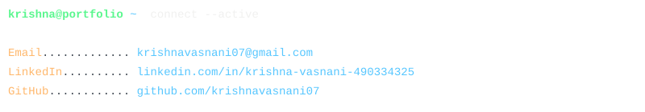
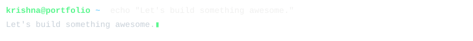

  

────────────────────────────────────────────────────────────────────────────────

  

  🔗&nbsp;<b>Direct Links:</b>&nbsp;
  <a href="https://github.com/krishnavasnani07/n100-financial-intelligence-platform" style="color: #57c7ff; text-decoration: none;">[Financial Platform]</a>&nbsp;•&nbsp;
  <a href="https://github.com/krishnavasnani07/fundsight-mutual-fund-analytics" style="color: #57c7ff; text-decoration: none;">[FundSight Analytics]</a>&nbsp;•&nbsp;
  <a href="https://github.com/krishnavasnani07/second-pair-of-eyes" style="color: #57c7ff; text-decoration: none;">[Second Pair of Eyes]</a>&nbsp;•&nbsp;
  <a href="https://github.com/krishnavasnani07/CinAImatic" style="color: #57c7ff; text-decoration: none;">[CinAImatic]</a>

────────────────────────────────────────────────────────────────────────────────

  

────────────────────────────────────────────────────────────────────────────────

  

────────────────────────────────────────────────────────────────────────────────

  

  ✉️&nbsp;<a href="mailto:krishnavasnani07@gmail.com" style="color: #57c7ff; text-decoration: none;">[Email]</a>&nbsp;&nbsp;•&nbsp;&nbsp;
  💼&nbsp;<a href="https://www.linkedin.com/in/krishna-vasnani-490334325" style="color: #57c7ff; text-decoration: none;">[LinkedIn]</a>&nbsp;&nbsp;•&nbsp;&nbsp;
  🐙&nbsp;<a href="https://github.com/krishnavasnani07" style="color: #57c7ff; text-decoration: none;">[GitHub]</a>

────────────────────────────────────────────────────────────────────────────────

 
<b style="color: #5af78e;">krishna@portfolio</b>:<b style="color: #57c7ff;">~</b><b>$</b>&nbsp;neofetch&nbsp;--system=metrics 
 

  
  &nbsp;
  

────────────────────────────────────────────────────────────────────────────────

 
<b style="color: #5af78e;">krishna@portfolio</b>:<b style="color: #57c7ff;">~</b><b>$</b>&nbsp;snake&nbsp;--grid=contributions 
 

  

────────────────────────────────────────────────────────────────────────────────

  

